# Midterm: 3D Object Detection

## Section 1 : Compute Lidar Point-Cloud from Range Image (ID_S1_EX1)

Extraction of two data channels within the range image:
- the upper image represents the range data channel,
- the bottm image represent the intensity data channel. 

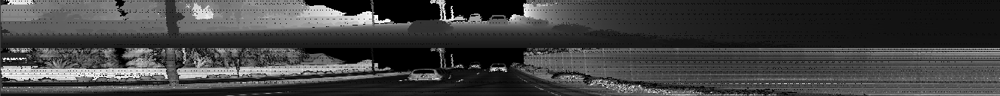

Visualisation of the Lidar point-cloud:

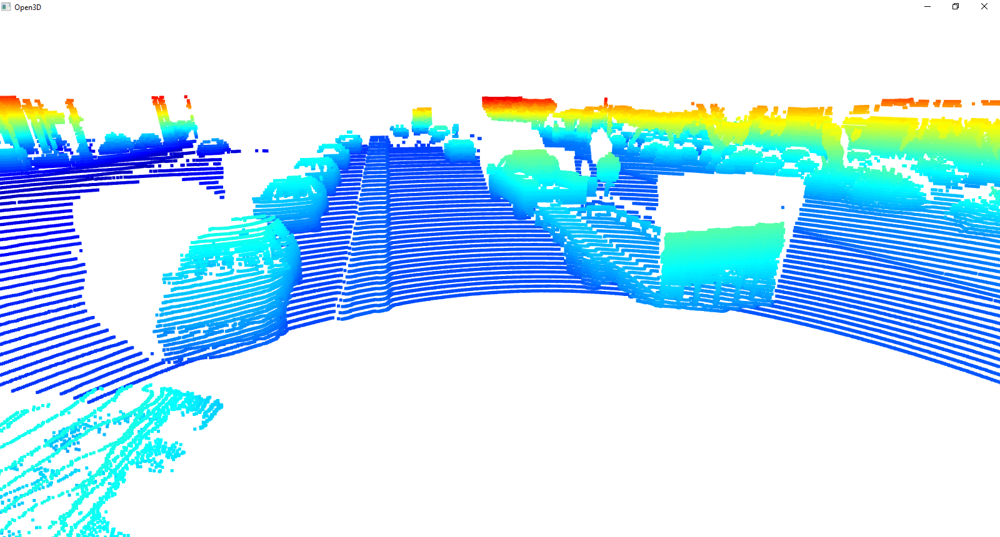

Examples of cars caught with Lidar on the street:
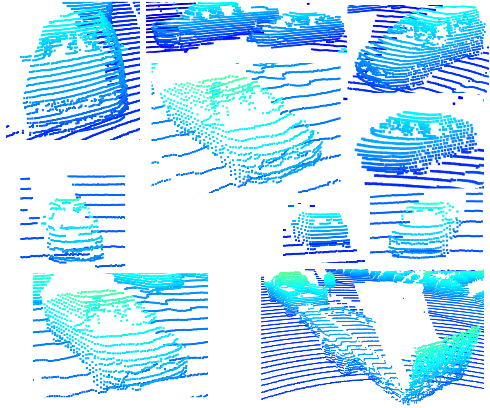

From the above image it can be seen that the further a car is from the Lidar sensor, the less discernable it becomes. The closer cars are composed of more points and more of their characteristics are observable. The closeset object is the truck with a trailer attached. The geometry of the car - a pick up truck is easy to recongize. The wheels as well as the wheel arches can be seen on the trailer. For the cars moving in the opposite direction the wheels are usually seen as well as the car frame - front, center and end pillars, roof and hoods. In cars which are further away either their overall bodywork is discernable and the side mirrors (either when the car is behind, or in front of the Waymo car). The geometry of the front and rear windows is also quite easy to recongize. 

Below are different views caught by the sensors, which show the pickup truck with the trailer:
- point cloud view:
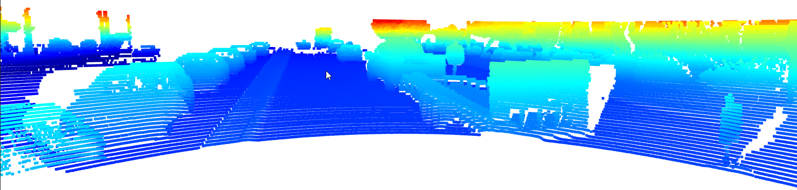
- range image:
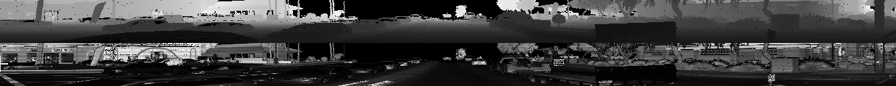
- intensity layer from the BEV map:
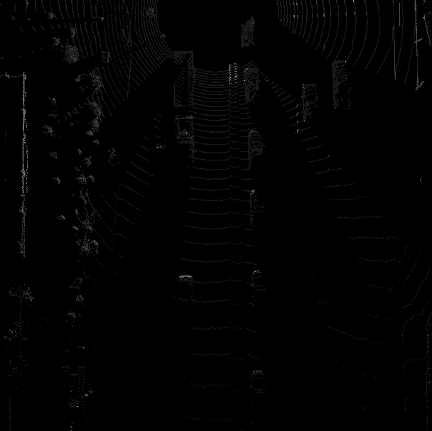

## Section 2 : Birds-Eye View from Lidar PCL (ID_S2_EX1), (ID_S2_EX2), (ID_S2_EX3)

Conversion of sensor coordinates to BEV-map coordinates:

- birds-eye view (BEV) perspective of the lidar point-cloud:
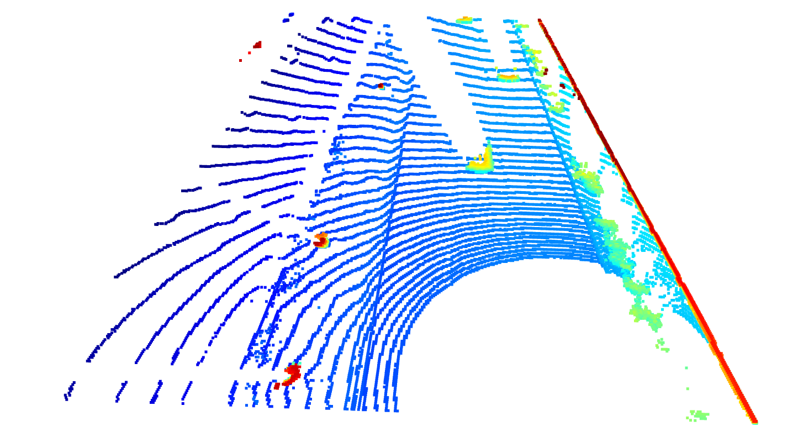

-  intensity layer of the BEV map:
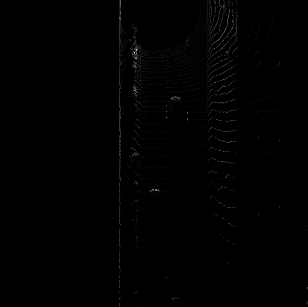

-  height layer of the BEV map
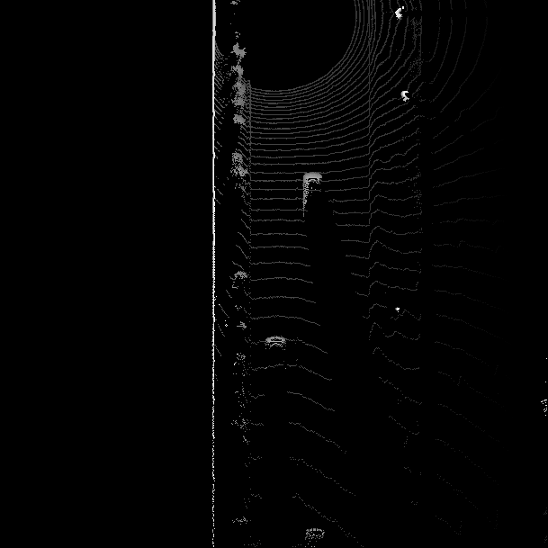

## Section 3 : Model-based Object Detection in BEV Image (ID_S3_EX1), (ID_S3_EX2)

The following parameters were extracted from the SFA3D model and added to the configs structure in load_configs_model:
        configs.K = 50
        configs.num_samples = None
        #configs.gpu_idx = 0
        configs.num_workers = 1
        configs.batch_size = 1
        configs.peak_thresh = 0.2
        configs.conf_thresh = 0.5
        configs.output_format = 'image'
        configs.output_video_fn = 'out_fpn_resnet'
        configs.output_width = 608

        configs.pin_memory = True
        configs.distributed = False  # For testing on 1 GPU only

        configs.input_size = (608, 608)
        configs.hm_size = (152, 152)
        configs.down_ratio = 4
        configs.max_objects = 50

        configs.imagenet_pretrained = False
        configs.head_conv = 64
        configs.num_classes = 3
        configs.num_center_offset = 2
        configs.num_z = 1
        configs.num_dim = 3
        configs.num_direction = 2  # sin, cos

        configs.heads = {
            'hm_cen': configs.num_classes,
            'cen_offset': configs.num_center_offset,
            'direction': configs.num_direction,
            'z_coor': configs.num_z,
            'dim': configs.num_dim
        }
        configs.num_input_features = 4 

Extraction of 3D bounding boxes from model response:
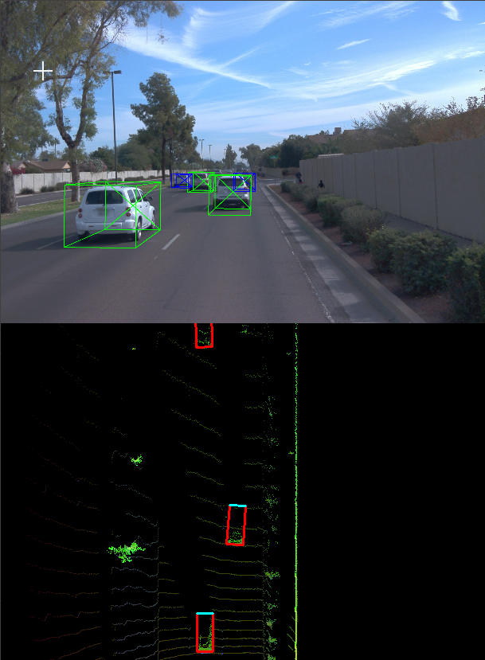

Model detections:

    processing frame #50
    ....
    student task ID_S3_EX1-5
    [[9.7223872e-01 3.5127075e+02 2.1875238e+02 1.0574490e+00 1.6241086e+00
    2.0172735e+01 4.7542789e+01 1.3822002e-02]
    [6.2091374e-01 3.1184229e+02 3.5521008e+02 1.1316251e+00 1.7765536e+00      
    2.0849136e+01 4.6748154e+01 8.4768860e-03]]

    processing frame #51
    ...
    student task ID_S3_EX1-5
    [[ 9.0935510e-01  3.5153265e+02  2.1939409e+02  1.0489278e+00
    1.6082902e+00  2.0308041e+01  4.8363377e+01  1.2367911e-02]
    [ 8.0556732e-01  3.1226596e+02  3.5451572e+02  1.1078368e+00
    1.7661636e+00  2.0709120e+01  4.8925690e+01  6.6410281e-02]
    [ 7.8161073e-01  3.5299170e+02  6.0305402e+02  1.2087985e+00
    1.6976423e+00  1.9822773e+01  5.0056709e+01 -3.2651678e-02]]

## Section 4 : Performance Evaluation for Object Detection

Precision and recall:

Precision and recall verification for ground truth labels used as objects:
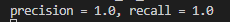

Performance measures:
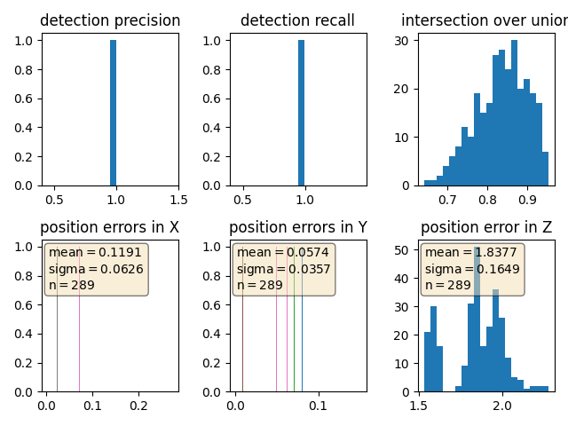